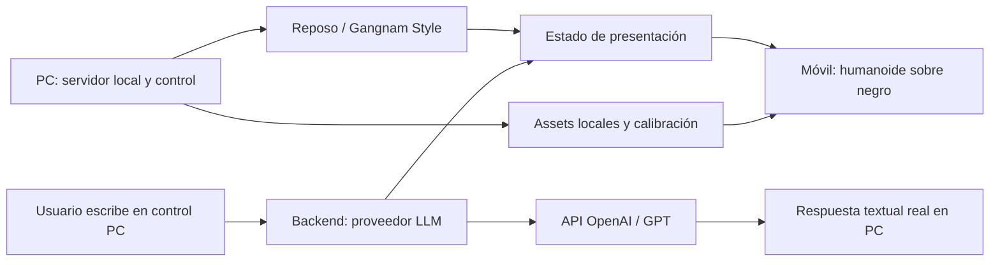

# Cortana — MVP holográfico activo

Actualizado: 2026-10-08. Primero visor, después conversación por texto y después voz. Este documento describe la asistente del corte solicitado para mañana; visor y conversación textual implementados; aceptación móvil/física pendiente.

La versión previa del agente del simulador se conserva en `docs/archive/Cortana-2026-10-05.md`. Alcance actual: `SPECIFICACTIONS.MD`; tareas/estados: `ROADMAP.MD`; tarjetas y pruebas: `docs/plans/2026-10-07-mvp-holograma.md`.

## 1. Qué es Cortana en esta entrega

Un humanoide sencillo adquirido de internet, visible sobre negro puro en celular/pantalla y calibrable para una caja Pepper’s Ghost. No requiere parecido exacto, lipsync, rig nuevo ni shaders complejos. Por nueva petición del propietario incluye modos vertical/horizontal y un baile libre, activable desde PC.

GPT es ahora principal para texto; falta su clave privada para verificar una respuesta real. El usuario escribe desde PC; el móvil mantiene el avatar. Ollama queda como alternativa explícita, seleccionable desde el panel con Qwen local (H-23). Reconocimiento y respuesta hablada se agregan después de la demostración de mañana.

## 2. Flujo activo

Visor independiente: arranca sin clave y sigue visible si falla la IA. El móvil carga un modelo local servido por PC y renderiza en su navegador. No envía secretos ni necesita estado de un campo de batalla.

## 3. Estados y presentación

- Visor: `loading`, `ready`, `error`; durante carga/error conserva negro y el diagnóstico aparece en el panel de ajustes o control, nunca como HUD automático.
- Conversación pública: `idle`, `processing`, `responded`, `error`. Cancelar devuelve a `idle`; el control informa la cancelación.
- Conectividad: separada del estado visual. Desconexión no borra el modelo ya cargado; reconexión obtiene sesión/revisión actual.
- No usar `listening` o `speaking` hasta tener STT/audio real. Cambios de estado son discretos y no proyectan botones/texto.

Ruta móvil `/hologram`: fondo #000000, una figura, controles ocultos. Ajustes: modo automático/vertical/horizontal, escala, desplazamiento, rotación y espejo horizontal/vertical. Patrón F temporal prueba orientación mediante caja real; desaparece al presentar. Guardar ajuste por dispositivo y poder restablecerlo. El modo añade 90° si la postura del viewport no coincide con el montaje; rotación adicional y espejos siguen independientes. No bloquea el SO del celular.

Movimiento público separado del diálogo: `idle` o `gangnam`. Botones **Reposo** y **Bailar Gangnam Style** en `/control`; backend valida la selección y los visores la recuperan por polling. Cambiar baile no llama a GPT. Reiniciar chat conserva movimiento; reiniciar servidor vuelve a reposo. No hay música ni sincronización exacta de frames entre pantallas.

## 4. Modelo y materiales

Avatar activo: Superhero Male de Quaternius, CC0, obtenido del repositorio ProgramAsWeights/avatar con procedencia y licencia conservadas. GLB de 741320 bytes, 14318 triángulos, 65 huesos y sin recursos externos. Baile: recreación Gangnam Style de ese proyecto, MIT, convertida a un clip local de 7.273 s y 30 FPS; 162676 bytes para reposo y baile. No usa assets oficiales de Epic ni audio. Ficha/hashes/licencias y comando de regeneración en `public/models/README.md`. CesiumMan anterior se conserva con licencia como histórico, sin cargarse en el visor activo.

Inicialmente blanco/gris luminoso para contrastar sobre negro. Silueta completa con márgenes; sin suelo, skybox ni entorno. Contornos triangulares opcionales ya disponibles; outline fino y arte final después de verificar reflejo. Reacción al procesamiento o animación de reposo son mejoras; no desplazan H-08.

### Variante Cortana aportada (2026-10-08)

Opción **Cortana importada**: `?avatar=cortana` en control/visor. Copia local del GLB proporcionado, 18,948 triángulos y rig de 79 joints, cuatro materiales con ocho imágenes originales integradas, frente corregido 180° y pose estática. Original intacto y atribución/CC BY-NC declarada conservadas en la ficha. No reproduce su clip Twerking ni reutiliza Gangnam del rig Quaternius. Cada pantalla abre su URL; selección visual no cambia proveedores ni conversación backend. La adaptación H-26 conserva color, alpha del cabello y mapas normales/emisivos; el fondo y la interfaz permanecen negros/monocromáticos. No es aún selección de avatar final ni prueba de caja. Preparación de movimientos: `docs/GUIA_RIG_ANIMACIONES.md`; aprovechar el rig existente antes de plantear uno nuevo.

## 5. Conversación y proveedor

Control PC separado del área reflejada: escribir, enviar, cancelar, leer respuesta y ver estado/proveedor. Personalidad aplicada mediante prompt del backend: «Eres Cortana, asistente de un prototipo holográfico. Responde en español de forma breve. Este MVP solo muestra tu modelo y admite conversación; no afirmes controlar un simulador ni dispositivos».

Sin herramientas de estrategia ni acciones de mundo en este corte. No anunciar «tanque creado», «escuchando» o «hablando» cuando esas funciones no existen. Historial breve y explícito; reiniciar conversación no reinicia calibración.

Selector del control PC: **GPT / OpenAI** o **Local / Ollama (Qwen)** y modelo instalado. **Actualizar modelos** vuelve a consultar Ollama; **Cambiar modelo** inicia conversación nueva, conserva baile/calibración y aplica hasta reiniciar servidor. No hay cambio automático ante errores.

Proveedor principal: OpenAI Responses con `gpt-4.1-mini`, seleccionado para chat breve sin razonamiento previo. Falta clave privada; latencia/calidad real todavía no comprobadas. Adaptador local disponible al elegir `LLM_PROVIDER=ollama`, sin fallback automático. Clave únicamente en backend PC; suscripción ChatGPT/Codex no equivale a créditos API. Ver `docs/API_OPENAI.md`.

Implementado: un envío activo, descarte de respuestas tardías, timeout 60 s tras un fallo real con 30 s en CPU, reintentos manuales e IDs idempotentes. Ollama limita salida a 48 tokens; OpenAI a 256. El contexto del servidor conserva seis pares y se reinicia desde el control. Falla de proveedor produce error en control; pantalla de proyección sigue negra con figura.

## 6. Caja y calibración

Un reflector principal, una imagen frontal. No duplicar la figura en cuatro cuadrantes. Confirmar posición de pantalla, reflexiones y ángulo con el patrón; la caja puede necesitar espejo o rotación según montaje.

Los valores numéricos permiten repetir el montaje: tamaño 25–200 %, desplazamiento X/Y −45…45 % y giro del cuerpo en pasos de 5°. Cambios válidos se aplican al escribir; Enter confirma y acota límites. Espejos y rotación de pantalla siguen independientes. Cerrar el panel conserva el patrón si está activo; para presentar al humanoide desactiva «Patrón de prueba» o pulsa Restablecer. La recarga recupera ajustes y muestra siempre el modelo.

La caja y pantalla reales determinan tamaño y contraste; no asumir OLED ni dimensiones. Un píxel RGB 0/0/0 no garantiza negro físico de la pantalla. H-08 registra luz, punto de observación, material, defectos y evidencia real. El modelo debe seguir dentro del reflector sin UI visible.

## 7. Etapas posteriores

H-15: TTS real, una sola salida activa, interrupción y avatar ligado al audio. H-16: pulsar para hablar en PC, transcripción editable y envío explícito. H-17: voz→LLM→TTS→avatar con pruebas de recuperación. Micrófono móvil requiere comprobar permisos/contexto seguro antes de escogerlo.

Modelo final, labios, escucha por nombre y app instalada son H-18 diferido. El baile solicitado se implementa en H-22 como animación concreta; no reactiva otros gestos ni el simulador. Herramientas tácticas y análisis de batalla permanecen en archivo histórico.

## 8. Criterios de éxito

- A visual: figura de internet completa, negro digital comprobado, calibración persistente, visor real estable y prueba óptica fotografiada/grabada.
- B LLM: 3 preguntas nuevas y seguimiento, respuesta no pregrabada, errores controlados y figura estable.
- Voz: posterior; no requisito para declarar A+B.

Hay capturas y mediciones PC/LLM local en el reporte inicial; orientación y baile tienen evidencia nueva en `docs/reports/2026-10-07-H-20-22-gpt-orientacion-baile.md`. La limitación previa del seguimiento de chat no se presenta como resuelta. Próximo paso: clave privada para H-20 y datos físicos H-19; H-07/H-08 validan dispositivo/caja. No hay aprobación física ni latencia GPT medida.
