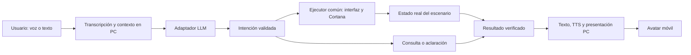

# Cortana — Asistente de Halo Strategy Lab

Actualizado: 2026-10-05. Estado: diseño funcional alineado con los requisitos actuales; implementación y selección tecnológica pendientes.

Este documento sustituye la propuesta original centrada en un celular holográfico. Define el comportamiento de Cortana y su integración con el simulador de escritorio y el móvil. `SPECIFICACTIONS.MD` es la fuente de alcance global, decisiones y contratos; `ROADMAP.MD` contiene las tareas y su estado. Si una propuesta aquí cambia el alcance, actualizar esos documentos antes de implementarla.

## 1. Objetivo y prioridades

Cortana tiene tres funciones: conversar por voz, ejecutar instrucciones autorizadas mediante herramientas del programa y analizar el escenario con información real. Su representación visual aparece en el PC de forma sencilla y se reproduce en un móvil externo.

Prioridad confirmada: **asistente de voz → agente de comandos → diseño de interfaz → editor/simulador → mejoras visuales y funcionales**. La conversación debe funcionar sin un mapa abierto. No esperar a tener un holograma, avatar final o batalla completa para entregar la primera versión útil.

Condiciones del proyecto: Linux principal, Windows como objetivo secundario, un usuario, sin presupuesto y plazo inferior a dos meses. Laptop con RTX 3050 como referencia; CPU/RAM/VRAM y móvil aún pendientes. No hay motor, modelo LLM ni proveedor de voz seleccionados.

## 2. Alcance por entrega

| Entrega | Comportamiento de Cortana | Evidencia necesaria |
|---|---|---|
| M0: conversación | Pulsar para hablar, transcripción, conversación LLM, respuesta textual/hablada, interrupción y estados visuales. | Conversar sin escenario y recuperarse de un fallo de audio/proveedor. |
| M1: agente | Interpretar comandos de edición sobre un estado mínimo real, resolver referencias y deshacer. | Consultar el cambio realizado y revertirlo; no basta un JSON o respuesta ficticia. |
| M2: editor | Usar los mismos comandos que los controles manuales para unidades, atributos, rutas y terreno. | Cambios consistentes en estado, vista 3D y composición exportada. |
| M3: análisis/simulación | Controlar acciones disponibles de simulación, explicar datos observados y sincronizar la presentación móvil. | Resultado verificable, análisis basado en datos reales y reconexión del avatar sin duplicar acciones. |

Reproducción móvil: T-27 puede avanzar después de M0. Palabra clave «Cortana», escucha continua, lip-sync fino, gestos avanzados y RAG dedicado son ampliaciones. El reflector holográfico sigue pendiente de confirmación; el móvil como pantalla del modelo sí forma parte del objetivo actual.

## 3. Arquitectura funcional propuesta

El PC es la única autoridad del escenario y los comandos. Se propone procesar micrófono, STT, LLM y TTS en PC; el móvil presenta el modelo y estados. La ubicación definitiva del audio se resuelve en Q-05 de la especificación.



Responsabilidades:

- STT convierte audio a texto; no ejecuta acciones.
- LLM conversa o propone una intención usando el catálogo habilitado.
- Resolver/validador comprueba contexto, argumentos, referencias y estado.
- Ejecutor aplica una acción y registra resultado e historial.
- TTS convierte una respuesta final a audio; no interpreta órdenes.
- Presentación PC/móvil refleja estado, habla y errores; no gobierna la simulación.

Separar estos componentes mediante adaptadores. El primer dominio puede ser pequeño y sin renderizado; sigue siendo un estado real. Los dobles de prueba solo sirven para pruebas y nunca demuestran funcionalidad de producto.

## 4. Interacción por voz y máquina de estados

Interfaz mínima: botón o tecla para hablar, transcripción editable, enviar, cancelar, contexto visible, respuesta textual y control para detener audio. El texto sigue disponible si falla el micrófono o TTS.

Estados de interacción propuestos:

| Estado | Qué ocurre | Salida esperada |
|---|---|---|
| `IDLE` | Preparada, sin captura activa. | Pulsar para hablar o enviar texto. |
| `LISTENING` | Captura mientras el usuario habla. | Soltar/finalizar o cancelar. |
| `TRANSCRIBING` | Convertir audio a texto. | Mostrar transcripción o error. |
| `REVIEWING` | Revisar texto antes de enviar; revisión explícita propuesta para el primer MVP. | Enviar, corregir o descartar. |
| `PROCESSING` | Solicitar respuesta/intención al proveedor. | Conversación, aclaración, propuesta o error. |
| `AWAITING_CLARIFICATION` | Falta una referencia o parámetro. | Usuario aporta información; revalidar contexto completo. |
| `AWAITING_CONFIRMATION` | Operación que puede perder trabajo. | Confirmar o cancelar; volver a validar revisión. |
| `EXECUTING` | Ejecutar una acción validada. | Resultado registrado o fallo sin cambios parciales. |
| `SPEAKING` | Reproducir la respuesta final. | Finalizar o detener audio. |
| `ERROR` | Explicar fallo y recuperación. | Reintentar o volver a `IDLE`. |

No anunciar estados de etapas futuras como si ya funcionaran. La conectividad móvil tiene estado separado (`DISCONNECTED`, `CONNECTING`, `CONNECTED`); un móvil desconectado no bloquea conversación ni edición en PC.

Para el MVP se propone silenciar captura durante la respuesta hablada y usar botón para interrumpir. Escuchar continuamente y cancelar eco por voz queda fuera del corte inicial.

Cada interacción tiene identidad propia. Cancelar una solicitud pendiente invalida sus respuestas tardías para que no cambien el escenario después. Interrumpir TTS no revierte una acción ya ejecutada: para eso existe deshacer. Una operación que ya comenzó a confirmarse en el dominio debe terminar con resultado consistente antes de admitir la siguiente mutación.

## 5. Contextos y límites de información

| Contexto | Información disponible | Comportamiento |
|---|---|---|
| Conversación | Personalidad, diálogo reciente y conocimiento disponible del modelo. | Conversar; admitir incertidumbre sobre lore y no inventar acceso al escenario. |
| Edición | Selección, punto marcado, entidades pertinentes, unidades/atributos permitidos, modo y revisión. | Proponer acciones disponibles y aclarar referencias ambiguas. |
| Análisis | Resumen real, objetivo, tiempo, bandos, estadísticas y eventos permitidos. | Explicar hechos y proponer alternativas, sin ejecutar táctica por iniciativa propia. |

Modo visible y seleccionable. Mantener historial limitado por contexto y sesión. Al cargar otra composición, invalidar referencias y selección antiguas; no resolver «ese tanque» con una entidad de otro mapa.

En vista táctica limitada, proporcionar solo información que conoce el bando observador. No revelar un enemigo oculto a través de una sugerencia. En vista omnisciente, indicar esa condición. Las reglas de conocimiento compartido y caducidad de avistamientos aún dependen del diseño de combate.

Las sugerencias son hipótesis sustentadas en atributos y estado observados, no garantías de victoria ni búsqueda estratégica exhaustiva. Cortana no decide daño, movimiento o detección: los calcula el simulador.

## 6. Herramientas habilitables

El catálogo global está en la sección 7 de `SPECIFICACTIONS.MD`. Habilitar una herramienta solo cuando su ejecutor esté implementado, verificado y permitido en el estado actual.

| Grupo | Acciones |
|---|---|
| Unidades | `add_unit`, `move_unit`, `rotate_unit`, `remove_unit`, `select_unit`, `set_unit_attributes`. |
| Preparación | `set_route`, `edit_terrain`, `paint_water`. |
| Simulación | `start_simulation`, `pause_simulation`, `resume_simulation`, `reset_simulation`, `set_simulation_speed`. |
| Historial | `undo`, `redo`. |
| Consulta | `describe_selection`, `get_scenario_summary`. |

Inicialmente una acción mutante por solicitud. No agregar comandos de brillo, sistema operativo, ejecución de código o rutas arbitrarias por haber aparecido en el documento antiguo. Perfiles de proveedor, exportación/carga y permisos se administran en interfaz salvo ampliación explícita del catálogo.

Reglas de resolución:

- «Este tanque» usa selección explícita; sin ella, pedir precisión.
- «Junto a la base» necesita un punto nombrado o entidad identificada, no una base inventada.
- «A la derecha» usa marco de mapa/cámara/unidad identificado; preguntar si falta.
- Posición absoluta debe incluir las coordenadas necesarias; altura terrestre la calcula el dominio.
- Usar IDs estables y comprobar que plantilla/bando/posición sean válidos.
- Una posición cercana debe respetar agua, pendientes, límites y ocupación definidos por el dominio.

## 7. Intención, validación y resultado

La intención LLM sigue el contrato ilustrativo de la especificación; su esquema formal se implementará en T-16. El sistema asigna/verifica ID de solicitud y revisión del escenario, y no acepta valores inventados por el modelo.

Antes de mutar: validar esquema, catálogo, estado, referencias, números finitos, rangos y revisión actual. Revalidar tras una aclaración o confirmación. Reintentos de una misma solicitud no duplican acciones. Rechazar lo inválido con motivo y sin cambios parciales.

Propuesta de resultado interno emitido por el ejecutor, no por el LLM:

```json
{
  "schema_version": 1,
  "request_id": "req-001",
  "status": "succeeded",
  "action": "add_unit",
  "scenario_revision": 13,
  "data": {
    "entity_id": "unit-018",
    "type_id": "scorpion",
    "team_id": "team-a",
    "position": {"x": 42, "y": 1, "z": 19}
  },
  "undo_available": true
}
```

Formalizar también resultados de fallo, cancelación y acción no disponible en T-16. Este ejemplo no modifica el esquema global aprobado: es una propuesta para desarrollar su lado de resultados.

Construir la confirmación hablada desde ese resultado. En una mutación, preferir una frase verificable como «Scorpion colocado junto a la unidad seleccionada. Puedes deshacerlo». No reproducir «listo» a partir de una respuesta en streaming antes de validar y ejecutar. Si se utiliza streaming, ninguna fracción de JSON debe activar una herramienta.

Acciones reversibles se ejecutan con deshacer. Se propone confirmación para reemplazar composición o perder una ejecución; no pedir confirmación por cada colocación. La política definitiva figura en la especificación.

## 8. Personalidad y ejemplos

Propuesta de personalidad: español claro, tono sereno y preciso, humor ocasional, referencias discretas a Halo y respuestas breves en operaciones. No permitir que la actuación del personaje oculte errores o datos faltantes. No asumir una voz, modelo o lore completo disponible.

Instrucción base propuesta para el LLM:

> Eres Cortana, asistente de Halo Strategy Lab. Conversa en español y respeta el contexto activo. Solo propone herramientas habilitadas ante instrucciones del usuario. No inventes entidades, coordenadas ni resultados. Pide aclaración si falta una referencia. Usa el esquema configurado para proponer acciones; el programa las valida y ejecuta. Distingue datos observados de sugerencias. No reveles información fuera del conocimiento del observador ni ejecutes tácticas por iniciativa propia.

El prompt expresa comportamiento; la validación del programa garantiza integridad. Lore/RAG dedicado no es dependencia del MVP.

| Usuario | Reacción esperada |
|---|---|
| «Cortana, ¿qué puedes hacer?» | Explicar funciones realmente disponibles en la entrega actual. |
| «Agrega un tanque junto a esta unidad». | Resolver selección y posición legal; anunciar resultado solo después de ejecutar. |
| «Borra el tanque». | Si hay varios candidatos y ninguna selección, pedir ID o selección sin eliminar. |
| «Cambia su vida a 200». | Validar selección, modo edición y rango; cambiar solo esa instancia. |
| «Inicia simulación». | Ejecutar solo cuando herramienta y escenario estén listos; explicar lo que falta si no. |
| «¿Por qué no están disparando?» | Consultar alcance, visión, tiro y política de combate reales; admitir si no hay esos datos. |
| «Deshaz eso». | Revertir última operación válida en edición; no fingir revertir una batalla. |
| «Piensa una táctica mejor». | Ofrecer una sugerencia identificada como tal, sin mover unidades automáticamente. |

## 9. Proveedores, configuración y fallos

Selección de motor, bibliotecas de voz y modelo: T-02. El documento no confirma Unity, Android, Ollama ni proveedores del diseño antiguo.

Configuración propuesta: perfiles LLM con adaptador/URL/modelo/referencia a credencial, capacidades verificadas, tiempos de espera, STT/TTS/voz en español, botón/tecla, salida de audio y sesión móvil. Mostrar qué requiere internet y dónde se procesa audio/texto.

Cambiar URL/modelo solo basta entre APIs compatibles. Registrar soporte real de formato estructurado, herramientas y streaming; una capacidad no soportada debe producir alternativa explícita o error, no ejecución insegura. No se asume un estándar universal por nombre de proveedor.

Recorrido base gratuito/local; nube optativa con credenciales del usuario. Medir uso simultáneo de renderizado, STT, LLM y TTS antes de elegir tamaños de modelo. La GPU de referencia no permite garantizar latencia o cantidad de unidades sin prueba.

| Fallo | Recuperación |
|---|---|
| Micrófono no disponible | Explicar permiso/dispositivo y permitir texto. |
| Transcripción incorrecta | Corregir o descartar antes de enviar. |
| Proveedor sin respuesta | Cancelar/reintentar o cambiar perfil; controles manuales operativos. |
| JSON/acción inválida | No mutar; explicar fallo y permitir reformular. |
| Escenario cambió | Revalidar o pedir aclaración; no usar revisión antigua. |
| TTS falló | Mostrar texto y permitir reintentar audio sin repetir comando. |
| Móvil desconectado | Mantener PC útil; reconectar con estado actual y descartar mensajes viejos. |

No guardar claves/audio privado en mapas ni logs. Registrar tiempos e identificadores técnicos suficientes para diagnosticar sin copiar secretos.

## 10. Presentación PC, móvil y holograma

Aplicación blanco/negro con contornos. Panel Cortana integrado sencillo, estado legible, texto y botones. Para el avatar se propone empezar con silueta o modelo simple monocromático y reacción al habla, coherente con esa dirección. Arte final, expresiones y animación facial después.

El móvil reproduce avatar y estados; no necesita mapa ni catálogo de unidades. Protocolo por elegir en T-02: mensajes versionados de sesión, secuencia, estado y habla; recuperación de estado actual tras reconexión. Asociar el dispositivo a una sesión local y limitarlo a presentación. Nunca reejecutar una acción al reproducir un mensaje visual o de audio.

Una sola salida de voz activa. Si habla el móvil, sincronizar audio y animación mediante identidad del enunciado; si habla el PC, el móvil refleja el mismo enunciado/estado. El diseño exacto requiere conocer dispositivo y red. Un cliente móvil en navegador se puede evaluar por separado de la elección de escritorio para el simulador.

Si se confirma ilusión holográfica: modo con fondo negro, espejo, escala/posición/orientación calibrables y controles de prueba. No asumir pantalla OLED, dimensiones del reflector, altura proyectada o brillo máximo: medir con el celular y materiales disponibles. Probar óptica y legibilidad aparte, sin bloquear la asistente de voz.

## 11. Validación y tareas relacionadas

| Área | Verificación necesaria | Tareas |
|---|---|---|
| Voz/conversación | Español, corrección, cancelación, interrupción y recuperación; funciona sin mapa. | T-17, T-20, T-21, T-22. |
| Agente | Comando real, ambigüedad, valores inválidos, revisión obsoleta, reintento y deshacer. | T-05, T-16, T-07, T-08, T-18. |
| Simulación/análisis | Herramientas en estado correcto y datos reales, sin información oculta indebida. | T-19, T-31. |
| Móvil | Presentación, salida única, reconexión y ausencia de acciones duplicadas. | T-27, T-23. |
| Visual/plataformas | Monocromático legible y ejecución real en Linux; Windows declarado según evidencia. | T-24, T-25. |

Medir latencia por STT/LLM/validación-ejecución/TTS y FPS/memoria con servicios concurrentes. Los 2.5 segundos del documento anterior no son un requisito confirmado. Meta general de 30 FPS sigue como propuesta de la especificación, no como resultado observado.

Pendientes: hardware/móvil, fecha exacta, ubicación del audio, reflector, corte detallado y política de combate. Cortana no debe fijar esas decisiones a través de su prompt. El próximo trabajo de producto sigue siendo T-02, selección técnica; esta actualización documental no demuestra implementación.
