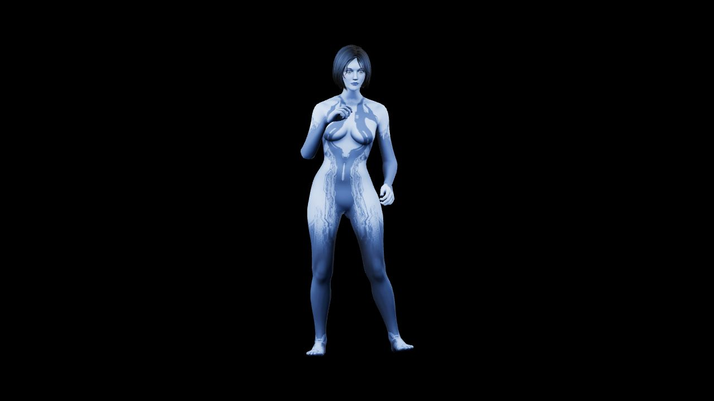

# H-26 — Texturas originales de Cortana

Fecha: 2026-10-08. Responsable: Codex. Objetivo: recuperar materiales del modelo aportado sin modificar el original ni perder rig/calibración.

Se preparó `public/models/cortana.glb` desde `/home/zapata/Downloads/cortana/charactershalo_4cortana.glb`. Conserva ocho PNG, cuatro materiales (ojos, cara, cuerpo, cabello), mapas difusos/emisivos/normales y transparencia del cabello. La conversión específica de especular/brillo cero a PBR conserva el BIN original byte a byte; el script rechaza otros casos. El visor clona los materiales originales y libera texturas al desmontar.

Una primera carga detectó imágenes `blob:` bloqueadas por CSP: el GLB cargaba geometría sin sus mapas. Se corrigieron `img-src` y `connect-src` para permitir blobs locales; no se habilitaron scripts externos. El visor ahora rechaza una carga incompleta sin los mapas esperados. Decisión D-28: colores originales en Cortana por petición del propietario, interfaz/fondo conservados.

Verificación ejecutada:

- `npm test`: 25/25 aprobadas; las pruebas del servidor requirieron puertos loopback fuera del sandbox. El primer intento restringido falló por ese entorno; el comando completo autorizado pasó.
- `npm run build`: correcto; aviso de bundle mayor de 500 kB, sin cambiar dependencias.
- Ocho imágenes PNG decodificadas; hash/tamaño, 18,948 triángulos, 79 joints y clip Twerking conservados. La prueba headless valida geometría/rig y sustituye la carga de imágenes; la comprobación gráfica siguiente usa las imágenes reales.
- Visor real PC, 1280×720: `ready`, cuatro materiales texturados, figura frontal completa. Cinco muestras de fondo RGB 0/0/0. Captura y mediciones: `evidence/H-26-cortana-textured.png` y `evidence/H-26-textures.json`.
- Tamaño numérico 75 %, patrón activado y panel oculto comprobados; restaurado tamaño previo 101 % y patrón apagado.

La captura de PC no prueba el teléfono ni el reflector. La pose sigue estática; el clip incorporado no se activa ni se adapta Gangnam de otro rig. Siguiente: H-27 guía de rig/animaciones, después H-28 Ollama Cloud. Autenticación del proveedor y pruebas físicas permanecen pendientes.
