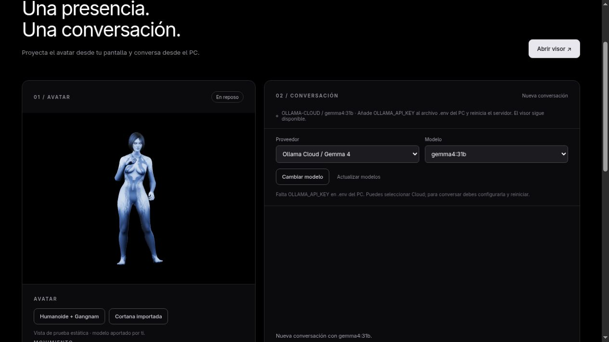

# H-28 — Ollama Cloud / Gemma 4 31B

Fecha: 2026-10-08. Responsable: Codex. Rama: `codex/cortana-gemma4-cloud`. Estado: BLOCKED únicamente para aceptación de conversación real.

Actualización posterior: el propietario configuró la clave y se verificaron respuestas, contexto y cancelación reales. H-28 ahora está DONE; ver [validación real](2026-10-08-H-28-validacion-cloud-real.md). Este reporte conserva la evidencia de preparación anterior.

Objetivo: probar Gemma en Cloud por petición del propietario, conservar GPT/Qwen y no descargar un modelo grande en la laptop.

Cambios: adaptador `ollama-cloud`, destino fijo HTTPS y Bearer privado, modelo `gemma4:31b`, respuesta no streaming/pensamiento desactivado y 256 tokens. Selector incluye los tres proveedores. Mantiene seis pares, timeout 60 s, cancelación e IDs; cambiar proveedor vacía contexto/cache sin alterar calibración/movimiento. Errores de autenticación, acceso, créditos, modelo y cuota tienen mensajes de Ollama. No compra créditos, no activa planes ni cambia silenciosamente a otro proveedor.

`OLLAMA_CLOUD_MODEL`/`OLLAMA_API_KEY` documentados en `.env.example` y `docs/API_OLLAMA_CLOUD.md`. `.env` privado preparado para arranque Cloud/Gemma conservando variables GPT/local; clave Cloud sigue vacía. El entorno indica configuración GPT presente, sin revisar su valor ni hacer una llamada GPT. D-29 registra la preferencia temporal; Q-10 registra la credencial/acceso pendiente.

Verificación ejecutada en Node 22.22.2/npm 10.9.7:

- `npm test`: 29 aprobadas, cero fallos. Incluye contratos simulados (cabecera clave, contexto, abort, destino fijo, contenido final), errores y validación de cambios de proveedor. **Fixtures no son llamadas Cloud reales.**
- `npm run build`: correcto; JS 649.17 kB / 165.93 kB gzip, aviso ya conocido de chunk mayor de 500 kB.
- GET real del catálogo público `https://ollama.com/api/tags`: HTTP 200, `gemma4:31b` presente, 2026-10-08T22:35:15.508Z. No exige clave y no genera respuesta.
- Servidor real puerto 3000: Cloud/Gemma seleccionado, health.ready=false/verified=false; POST chat sin clave devuelve HTTP 503 y NOT_CONFIGURED. Estado público solo sessionId/revision/phase/animation. `evidence/H-28-cloud.json`.
- Control renderizado: selector Cloud→GPT→Cloud aplicado, modelo y mensaje de clave actualizados. Cortana conserva `ready` y cuatro materiales texturados tras el fallo/cambio. Calibración previa 101 % recuperada, patrón apagado. Captura: `evidence/H-28-cloud-control.png`.
- Revisión de secretos/bundle: solo nombres de variables/configuración pública; `.env` ignorado y no versionado. Claves de prueba identificadas como fixtures, sin credenciales reales en reportes.

Fuente técnica: [API Cloud](https://docs.ollama.com/cloud), [chat](https://docs.ollama.com/api/chat) y [Gemma 4](https://ollama.com/library/gemma4%3A31b-cloud). [Planes oficiales](https://ollama.com/pricing): Free tiene créditos iniciales/modelos limitados; no demuestra acceso gratuito/ilimitado a Gemma 31B de esta cuenta.

Pendientes: OLLAMA_API_KEY y acceso/cuota, tres respuestas+seguimiento con latencias y cancelación real; teléfono/reflector siguen en H-19/H-07/H-08. No se afirma integración real ni holograma físico terminado. Siguiente: configurar clave privadamente, reiniciar y ejecutar el recorrido de la guía. Ninguna dependencia de cuenta impide presentar Cortana con sus texturas.
