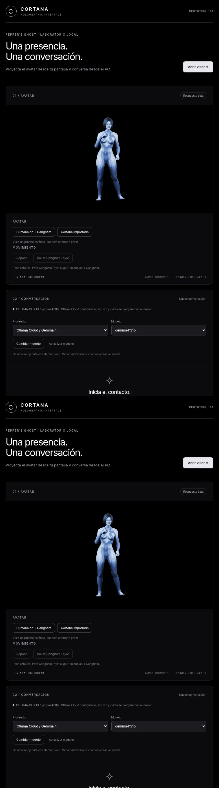

# H-28 — Validación real de Gemma Cloud

Fecha: 2026-10-08. Responsable: Codex. Rama: `codex/verificacion-demo-holograma`, desde `09ad91b` de main remoto (PR #1 integrado por el propietario). Estado: DONE para integración y conversación Cloud. El holograma físico mantiene su aceptación independiente.

El propietario guardó `OLLAMA_API_KEY` en el `.env` privado. Se reinició el servidor para cargarla y se probó `gemma4:31b` mediante el backend real de la aplicación. No se cambiaron claves, planes ni facturación. Entorno: Linux, Node 22.22.2, npm 10.9.7, servidor en puerto 3000.

| Solicitud completada | HTTP | Tiempo del backend |
|---|---|---|
| Presentación de Cortana | 200 | 833 ms |
| Explicación breve de Pepper’s Ghost | 200 | 588 ms |
| Guardar el nombre ficticio Ana en contexto | 200 | 484 ms |
| Recuperar el nombre Ana | 200 | 657 ms |
| Recuperar Ana después de cancelar el cambio a Bruno | 200 | 540 ms |

Son cinco generaciones reales, sin mocks. La medición abarca la espera de la respuesta completa del proveedor; no es tiempo al primer token ni garantía de latencia futura. Prompts, respuestas y mediciones están en [evidencia JSON](evidence/H-28-cloud-live.json). No se usó conversación personal.

Se inició otra solicitud para cambiar el nombre ficticio a Bruno, se observó `processing` y se canceló por `/api/cancel`. Cancelación HTTP 200, chat HTTP 499/`CANCELLED`, presentación de regreso a `idle`. La siguiente respuesta conservó Ana: el mensaje cancelado no se incorporó al contexto. Una cancelación puede ocurrir después de que el proveedor haya comenzado a procesar; esta prueba no mide créditos consumidos.

El control renderizado conservó Cortana `ready`, cuatro materiales texturados, orientación automática, tamaño 101 % y patrón apagado. El selector indicó Ollama Cloud / `gemma4:31b`. La captura muestra configuración y avatar; las consultas se enviaron por HTTP al backend y no se insertaron artificialmente en el chat del navegador. No se declara validado el recorrido completo de interacción del usuario en H-11.

La integración técnica conserva las 29 pruebas y el build del reporte anterior; en este incremento se cambió documentación, no código. [Preparación previa](2026-10-08-H-28-ollama-cloud.md). `.env` sigue ignorado por Git; los reportes no contienen credenciales.

Comprobación independiente GPT: GET autenticado al modelo configurado devolvió 401 en 279 ms, sin generar texto. [Evidencia H-20](evidence/H-20-auth-check.json). H-20 sigue BLOCKED hasta recibir una clave válida y probar una respuesta real; Cloud permanece seleccionado, sin fallback automático.

Límites: no se inspeccionaron plan, saldo o cuota de Ollama y no se afirma gratuidad ilimitada. Tampoco se midió calidad factual: la respuesta sobre Pepper’s Ghost usó «tangible», aunque la figura es una ilusión por reflexión. El contexto es temporal y acotado, no memoria persistente, aunque el modelo diga que guardó el nombre. Teléfono, reflector y validación óptica siguen pendientes en H-19/H-07/H-08.

Siguiente incremento independiente: H-29, diagnóstico de conexión sin generación desde el control, con distinción entre configuración y acceso comprobado. Después, completar las pruebas físicas cuando esté disponible el dispositivo/caja.
