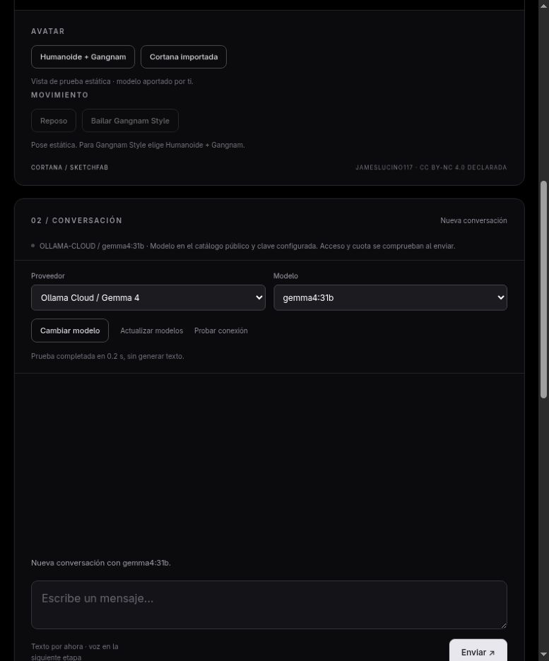

# H-29 — Diagnóstico de conexión

Fecha: 2026-10-08. Responsable: Codex. Rama: `codex/verificacion-demo-holograma`. Estado: DONE. Entorno: Linux, Node 22.22.2/npm 10.9.7; servidor real en puerto 3000.

Entrega Git: `e6d2714` registra H-28 real y `7f0aebe` implementa H-29. Ambos publicados en `origin/codex/verificacion-demo-holograma`, remoto verificado `ZapataFrame/halo-cortana`. La publicación no equivale a PR ni merge de estos avances en main.

Objetivo: distinguir configuración, disponibilidad y errores del proveedor antes de enviar una pregunta. Incremento independiente de la preparación móvil/caja; tarjeta del plan registrada antes de implementar. H-28 quedó guardado en `e6d2714` con conversación Cloud real.

Cambios: botón **Probar conexión**, adaptador de diagnóstico y `POST /api/provider/check`. Usa exclusivamente el proveedor activo del servidor, cuerpo `{}`, timeout 8 s y control privado loopback/Host/Origin. GPT consulta su modelo mediante GET autenticado; local consulta catálogo; Cloud consulta catálogo público sin enviar la clave. No genera texto. Indicador exige `ready && verified`; una clave presente no activa comprobación. La selección pendiente se aplica antes de probar.

El diagnóstico mantiene historial, cache idempotente, fase/revisión, movimiento y calibración. Durante un chat se rechaza con 409. Un contador de generaciones descarta el resultado si otra pestaña empieza un chat, incluso si este termina antes del GET; también se descarta si cambia proveedor. No se leen cuerpos privados de error y los fallos de red no exponen detalles internos. HTTP 200 significa diagnóstico completado: revisar `health` para su resultado.

Verificación ejecutada:

- `npm test`: **37 aprobadas**, cero fallos. Ocho casos nuevos cubren ausencia de clave sin tráfico, destino/GET/cabecera privados, errores 401/403/404/429 y cuerpo inaccesible, catálogo Cloud sin validación de credencial, red/aborto/recuperación, origen/Host/campos, estado/historial/cache intactos y consultas concurrentes. Son fixtures de contrato, no nuevas generaciones Cloud.
- `npm run build`: correcto; JS 650.12 kB / 166.17 kB gzip. Persiste el aviso conocido de chunk mayor de 500 kB; no se incorporaron dependencias.
- Backend real: Cloud/Gemma seleccionado, diagnóstico HTTP 200 en **164 ms**, `ACCESS_UNVERIFIED`/`verified:false`, presentación idéntica antes/después. Campo `model` rechazado con 400 y origen externo con 403. [Evidencia HTTP](evidence/H-29-connection-live.json).
- Panel renderizado: Cloud → GPT → local `phi4-mini:latest` → Cloud. Selección pendiente deshabilita la prueba; al aplicar puede usarse. Cloud conserva indicador neutro y explica el catálogo público; GPT informa clave ausente; local confirma servicio/modelo y activa indicador. Figura `ready`, cuatro materiales texturados, tamaño 101 %, cero mensajes añadidos. [Evidencia DOM](evidence/H-29-control.json) y captura inspeccionada debajo. Solo controles de proveedor/diagnóstico: no se automatizó el chat anteriormente rechazado.

Decisión D-30: consulta explícita sin generación ni actualización del contexto. El catálogo Cloud es público y no puede certificar clave/cuota. GPT valida disponibilidad del modelo, no presupuesto para Responses. El indicador representa esta comprobación puntual; recargar obtiene nuevamente información de configuración. La conversación real de Gemma sigue en [reporte H-28](2026-10-08-H-28-validacion-cloud-real.md).

La credencial GPT inicial devolvió 401 en una comprobación anterior ([JSON](evidence/H-20-auth-check.json)). Después del último reinicio se constató clave GPT ausente y `NOT_CONFIGURED` en la interfaz. No se restituyó ni cambió el `.env` del propietario; no se pretende haber reproducido un 401 en el botón con una clave ausente. Qwen fue probado antes en H-23; el catálogo local actual incluye `phi4-mini:latest` y `llama3.1:latest`.

Fuentes del contrato: [consulta oficial de modelo OpenAI](https://developers.openai.com/api/reference/resources/models/methods/retrieve), [catálogo Ollama](https://docs.ollama.com/api/tags) y [Cloud](https://docs.ollama.com/cloud). Secretos únicamente backend; `.env` ignorado, revisión del diff y búsqueda de credenciales reales antes del commit.

Pendientes: interacción manual de chat H-11, clave válida y generación GPT H-20, dispositivo/caja H-19 y pruebas físicas H-07/H-08. H-29 no cierra esas aceptaciones ni verifica plan/saldo Cloud. Siguiente trabajo: recorrido manual de tres preguntas/seguimiento/cancelación en PC y preparación del teléfono/reflector reales; voz y juego continúan diferidos.
