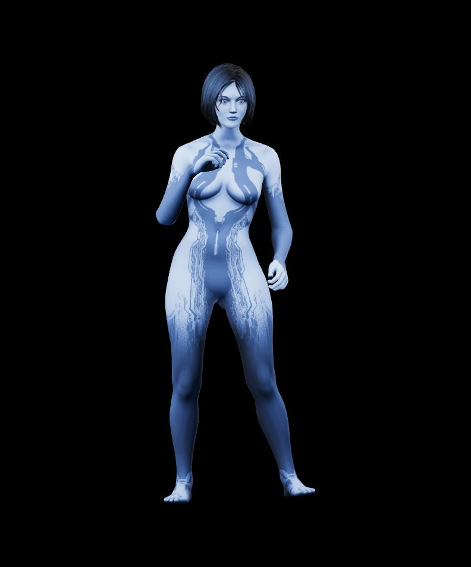
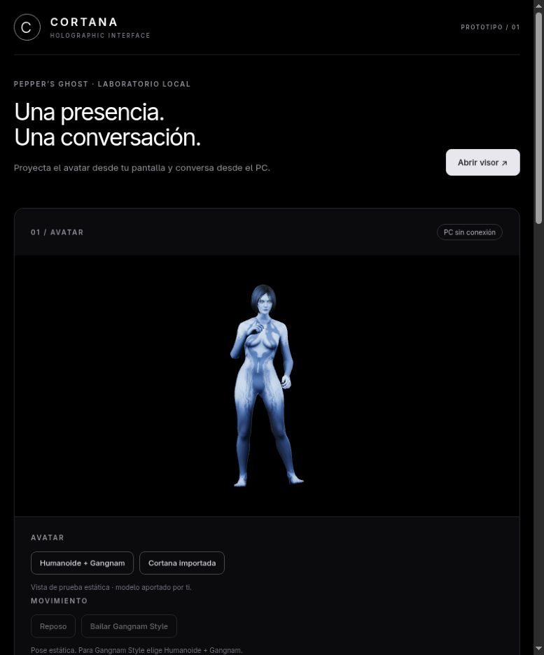

# H-30 — Recuperación de presentación en PC

Fecha: 2026-10-08. Responsable: Codex. Rama: `codex/verificacion-demo-holograma`. Estado: DONE para preparación PC independiente de H-12. Linux, Node 22.22.2/npm 10.9.7; servidor real en puerto 3000.

Objetivo: preparar la sincronización y recuperación mientras faltan dispositivo/caja y recorrido manual completo de chat. Plan previo registrado en la tarjeta H-30. Las dependencias físicas y aceptación de H-12 se conservan; no se inicia voz ni se cierra el MVP físico por este ensayo.

Cambios: módulo `src/presentation-sync.js` valida los cuatro campos del contrato público, rechaza estados inválidos/inconsistentes e ignora revisiones antiguas/duplicadas. Nueva sesión reconoce revisión cero. Mantiene una lectura activa, timeout 2.5 s y un temporizador de repetición; salir aborta el ciclo y volver descarta respuestas anteriores. Conserva polling sencillo, sin WebSocket ni nuevas dependencias.

Frontend: diagnóstico de conexión en control y calibración, sin HUD en la figura. Ante corte mantiene modelo/animación/ajustes y detiene pulso; reconectar recupera estado actual sin reenviar chat. La visibilidad foreground reinicia una lectura; navegación con caché suspende/reanuda el ciclo. D-31 registra el motivo y el alcance PC.

Verificación ejecutada:

- `npm test`: **44 aprobadas**, cero fallos. Siete casos nuevos cubren contrato corrupto/campos privados, revisión vieja/duplicada/nueva sesión, consulta única, respuesta tardía tras salir, red fallida/recuperación, suspensión/reanudación y timeout. Preserva los 37 casos existentes.
- `npm run build`: correcto, 15 módulos; JS 652.54 kB / 166.99 kB gzip. Aviso existente de chunk mayor de 500 kB.
- Visor real ya cargado en navegador PC: detener servidor → `offline`, figura `ready`, cuatro materiales, un canvas, pose/movimiento conservados, panel oculto y pulso `idle`. Reiniciar servidor → `connected`, nueva sesión y revisión **6 → 0** aceptada. No se recargó el visor durante el corte/reinicio.
- Segundo corte/reinicio en control: aviso **PC sin conexión**, Cortana `ready`, cuatro materiales y tamaño **101 %** conservados. Después nueva sesión/revisión cero, estado **En reposo**, conexión activa y cero mensajes añadidos.
- [JSON del ensayo](evidence/H-30-live.json). Las vistas se probaron **secuencialmente en una única pestaña**: el navegador devolvió el mismo ID al pedir una pestaña adicional. Una lectura inicial de los elementos del control durante la vista de proyección falló; se corrigió la verificación volviendo al control y ejecutando el segundo corte. No se cuenta esa lectura como éxito ni se afirma sincronización simultánea de dos dispositivos.
- Capturas reales 792×954 antes, durante y después de desconexión: cinco muestras de fondo por captura **RGB 0/0/0**, figura completa y sin HUD. [Muestreo](evidence/H-30-black.json). La captura del control muestra el aviso y la figura cargada.

No se enviaron preguntas al LLM ni se modificó `.env`. El servidor quedó restaurado con Ollama Cloud/Gemma y el navegador volvió al control Cortana. El reinicio sí vacía contexto temporal por contrato existente; antes del ensayo el chat visible y borrador estaban vacíos. Validación de contratos/ciclo de vida usa fixtures, mientras los cortes/reinicios y negro son reales.

Pendientes: H-11 manual, H-19/H-07/H-08/H-12 físicos, latencia ≤2 s en LAN móvil y mediana FPS/ensayo de 10 min. Este incremento no establece rendimiento de teléfono ni aprobación óptica. Se consultó Q-11 para adelantar voz PC y se solicitaron datos de dispositivo/caja; hasta recibir respuesta se conserva H-14→H-15. Siguiente paso: completar el recorrido manual de chat y abrir/calibrar el visor desde el dispositivo real.
